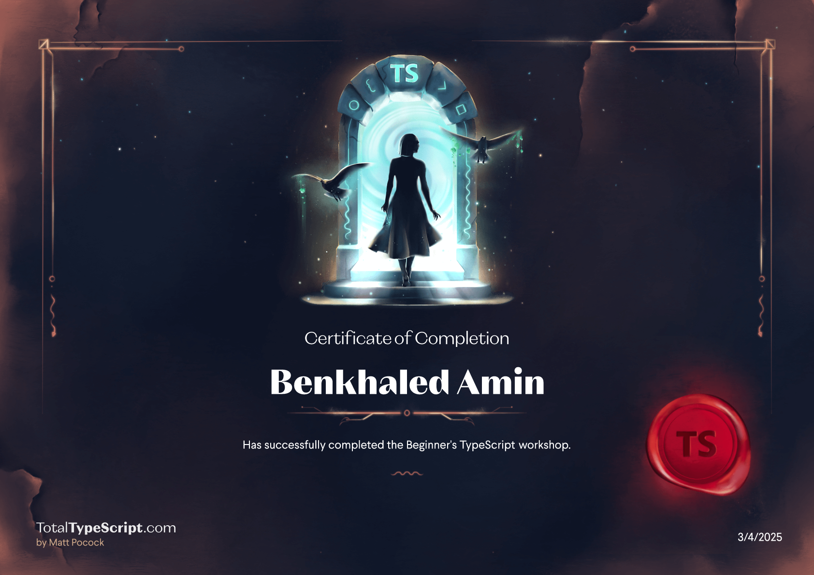
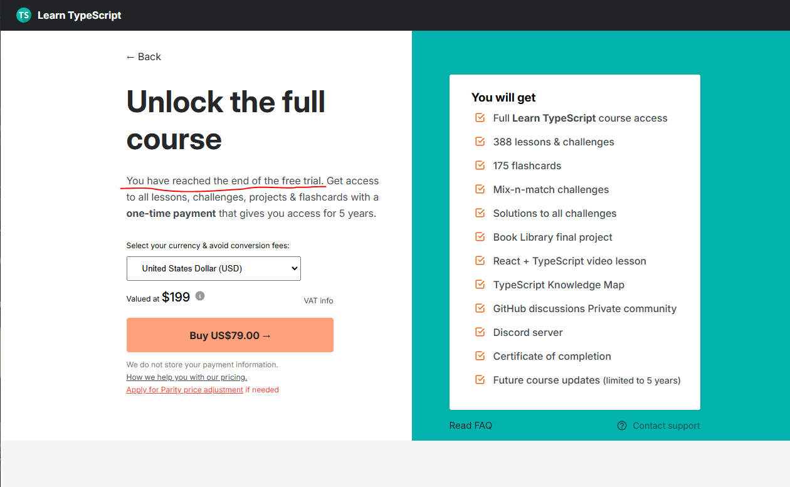
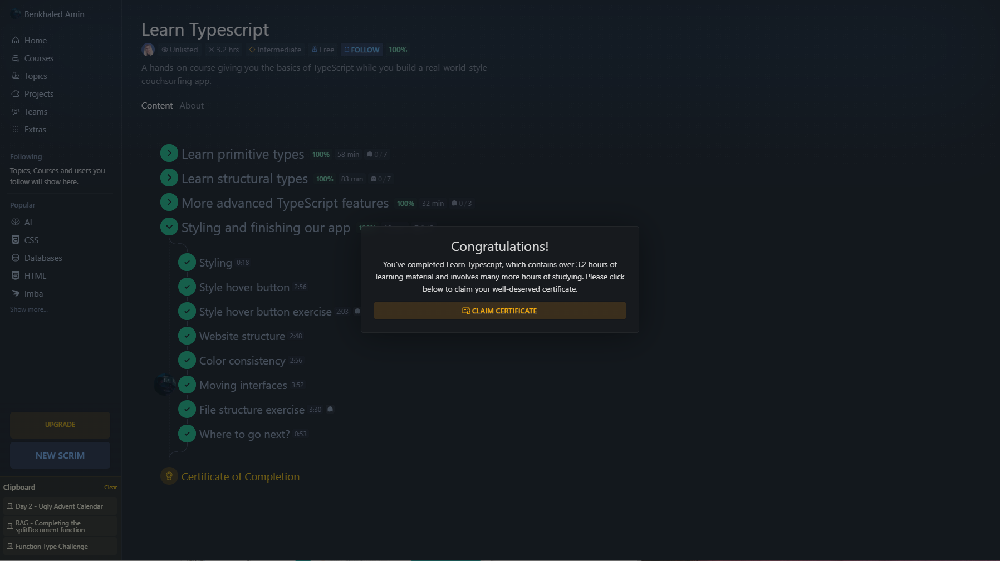

# My TypeScript Journey 👨‍💻

### Introduction

TypeScript has been on my list of technologies to master, especially after working with React and Next.js. Although I had attempted to learn it before, I never had the chance to dive deep until now. This time, I committed to a structured learning path by following several courses recommended by the RSSchool curriculum.

Through these courses, I built a strong foundation in TypeScript and improved my practical skills. However, I recognize that there’s still more to explore, particularly when it comes to using TypeScript effectively with the DOM, React, and mastering generic types. This document summarizes my progress so far, the courses I completed, and my thoughts on each learning experience.

## Completed Courses 👌

### [Total TypeScript](https://www.totaltypescript.com/tutorials/beginners-typescript)

✅ **Completed**

This course provided a solid introduction to TypeScript, covering essential concepts such as:

- The Implicit ‘Any’ Type Error Working with Object Parameters
- Passing Type Arguments
- Combining Types to Create New Types
- Selectively Constructing Types from Other Types
- Typing Functions
- Typing Async Functions
- And much more

The hands-on exercises were particularly useful in reinforcing the lessons.

### [Learn typescript.online](https://learntypescript.online/)

✅ **Partially Completed** (Free Trial Only)

This course was more in-depth compared to the Total TypeScript course, offering detailed explanations and interactive exercises. Although I only had access to the free trial, I was able to cover important topics such as:

- Introduction to TypeScript
- The `any` type
- TypeScript ESLint
- Primitive types
- Union types
- The type alias
- Arrays

Even though I couldn't complete the entire course, the sections I studied provided a deeper understanding of TypeScript fundamentals. I would love to revisit this course in the future if I get access to the full version.

### [TS Scrimba extra course](https://learntypescript.online/)

✅ **Completed** (Approx. 3 hours course)

A concise yet informative course that provided a hands-on approach to learning TypeScript. The interactive coding sessions made it easy to grasp concepts quickly, with a lot of practice tasks.

---

## My Thoughts

- **Usefulness:** Each course had a unique approach, and together they provided a well-rounded understanding of TypeScript.
- **Organization:** The structured lessons and interactive exercises made learning more effective.
- **Overall Experience:** Completing these courses has greatly improved my TypeScript skills and confidence. I'm excited to apply what I've learned to real-world projects! 🚀

---

## What's Next?

My journey with TypeScript doesn’t stop here. I plan to continue learning and refining my skills, focusing on areas where I still have gaps—such as working with the DOM, React, and mastering generic types. Additionally, I aim to explore more advanced TypeScript concepts and real-world applications. 🚀
